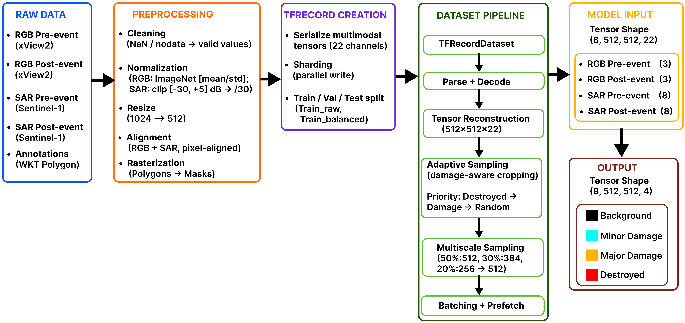
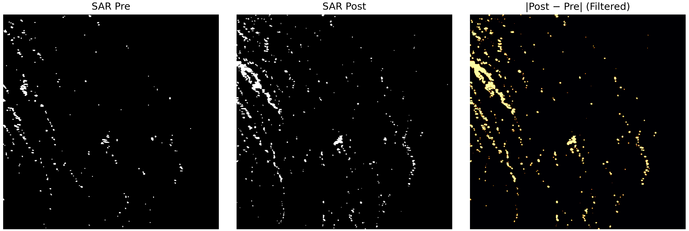
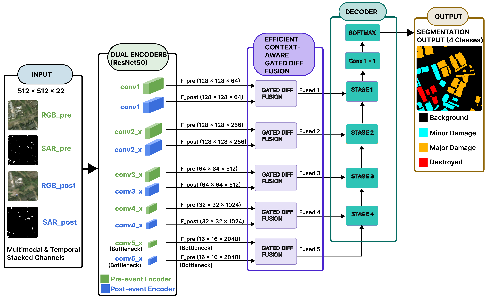
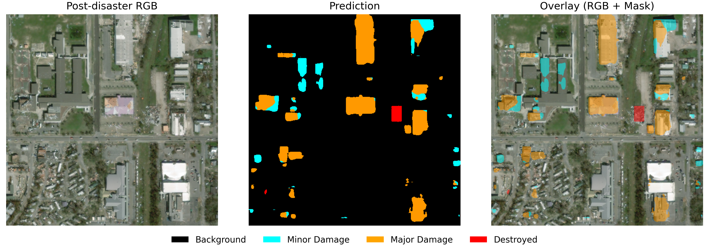
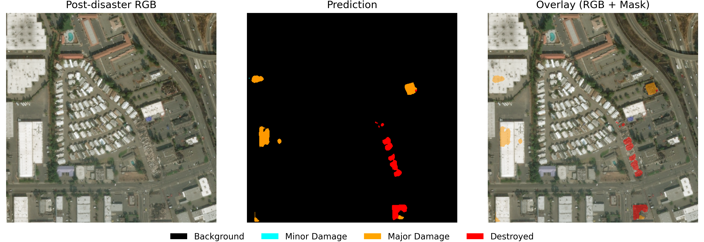
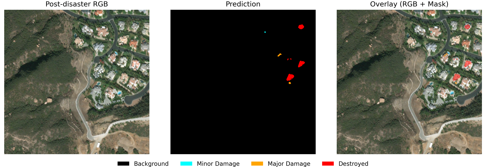

# Project 1

Multimodal Disaster Damage Segmentation  
with RGB + SAR Temporal Fusion

<div align="center">

[]()
[]()
[]()
[]()
[]()

</div>

---

---

# Project Overview

This project develops an end-to-end multimodal deep learning system for
post-disaster building damage segmentation using pre- and post-event
RGB satellite imagery together with Sentinel-1 SAR data.

The core challenge is to identify not only where buildings are damaged,
but also their damage severity under difficult conditions where optical
imagery alone may be limited by appearance changes, vegetation, flooding,
or other scene variability.

The final architecture, **Gated DIFF v3**, uses dual ResNet50 encoders,
explicit pre/post temporal differencing, and context-aware gated multimodal
fusion to combine RGB and SAR information across multiple feature scales.
A UNet-style decoder produces pixel-wise predictions for four classes:

- Background
- Minor damage
- Major damage
- Destroyed

The project covers the complete ML pipeline:

**multimodal data acquisition → preprocessing and alignment → TFRecord
construction → damage-aware training → temporal fusion modeling →
segmentation evaluation → qualitative analysis → system benchmarking**

### Final Results

| Metric | Gated DIFF v3 |
|---|---:|
| Test mIoU | **0.5136** |
| Damage IoU (GT-only) | **0.3564** |
| GPU Latency (batch=1) | **33.75 ms** |
| Throughput | **35.53 images/s** |
| Peak GPU Memory | **1.25 GB** |

Compared with the previous Gated DIFF v2 architecture, the final model
improves segmentation accuracy while reducing GPU inference latency from
approximately **2.39 s to 33.75 ms (~70× faster)**.

The resulting system demonstrates how explicit temporal reasoning,
multimodal RGB–SAR fusion, and architecture-level efficiency optimization
can be combined for practical disaster-response perception.

---

# Dataset & Data Sources



*End-to-end pipeline: preprocessing, alignment, TFRecords generation, and high-throughput training using tf.data.*

## Data Sources

- **xView2 (xBD dataset)**: High-resolution RGB imagery with polygon annotations and pixel-wise damage labels  
- **Sentinel-1 (SAR)**: Synthetic Aperture Radar imagery downloaded via Google Earth Engine  

---

## RGB Dataset (xView2)

The xView2 dataset is organized into:

- Train
- Hold (validation)
- Test

Each sample consists of:
- Pre-disaster RGB image  
- Post-disaster RGB image  
- Polygon annotations (JSON)  
- Pixel-wise damage labels (derived)

### Dataset Size

| Split | Raw Samples | After Filtering |
|------|------------|----------------|
| Train | 2799 | 2100 |
| Hold  | 933  | 694  |
| Test  | 933  | 696  |

Filtering removed samples with incomplete or missing annotation metadata.

---

## SAR Dataset (Sentinel-1)

SAR data was downloaded to match each RGB sample using a custom pipeline.

### Retrieval Strategy

For each event:

- Spatial region derived from RGB metadata  
- UTM-aware bounding box with padding  
- Temporal window centered around disaster event  

### Fallback Strategy (robust data acquisition)

The downloader uses a **multi-tier fallback system**:

- **Tier 1**: VV + VH, DESCENDING orbit, ≥4 acquisitions  
- **Tier 2**: VV + VH, ANY orbit, ≥4 acquisitions  
- **Tier 3**: VV only, ANY orbit, ≥2 acquisitions  

Temporal window is progressively expanded until sufficient data is found.

### Processing

- Convert SAR to dB scale  
- Clamp to:
[-30, +5] dB

- Stack multi-temporal acquisitions into multi-channel tensor  

---

## Dataset Composition

Each final sample contains:

- RGB (pre-disaster): 3 channels  
- RGB (post-disaster): 3 channels  
- SAR (pre-disaster): up to 8 channels  
- SAR (post-disaster): up to 8 channels  
- Segmentation mask: 4 classes  
  - background  
  - minor  
  - major  
  - destroyed  

---

## Notes

- Invalid samples (missing coordinates) were removed  
- All modalities are aligned at pixel level  
- All inputs resized to: 
512 × 512


---


# Data Preprocessing Pipeline

This project implements a **production-grade multimodal preprocessing pipeline** for disaster damage segmentation.

---

## 1. Cleaning & Structuring

### Objective
Ensure dataset consistency by removing invalid samples and structuring files.

### Approach
- Identified invalid annotations (missing coordinates)
- Removed corresponding samples across:
  - labels
  - images
  - targets
- Grouped files by postfix:
  - `pre_disaster`
  - `post_disaster`

### Outcome
- Clean dataset
- Consistent event-level grouping
- Deterministic data structure

---

## 2. Alignment (by Construction)

### Key Idea
Alignment is achieved **by construction**, not via reprojection.

### Method
- xView2 annotations already in pixel space (0–1023)
- SAR extracted using identical spatial footprints
- All modalities resized to: 
512 × 512


- Annotation scaling: 
1024 → 512 (scale = 0.5)


### Validation
- RGB + SAR overlay
- RGB + mask overlay
- RGB + SAR + mask composite

### Outcome
- Consistent pixel-level alignment across modalities
- No CRS transformations required
- No interpolation artifacts

---

## 3. Normalization

### RGB
- ImageNet normalization:
  - mean = [0.485, 0.456, 0.406]
  - std  = [0.229, 0.224, 0.225]

---

### SAR

#### Method: Global Linear Scaling

**Steps:**<br>
i. Replace nodata (-9999) → NaN → 0  
ii. Clip to: 
[-30 dB, +5 dB]<br>
iii. Scale: 
value / 30


---

#### Why NOT per-image normalization?
- Preserves physical meaning of SAR  
- Ensures cross-scene consistency  

---

### Critical Issue (Fixed)

**Problem:**

SAR_pre == SAR_post


**Fix:**
- Corrected temporal window in downloader  
- Re-downloaded SAR  
- Reprocessed normalization  

**Validation:**

mean(|post - pre|) ≈ 0.0004 – 0.02


---

### Outcome
- Physically meaningful SAR features  
- Stable distributions  
- Valid temporal signal  

---

## 4. Mask Generation

### Input
- Pixel-space GeoJSON (0–1023)

---

### Steps
i. Load polygons (Shapely)  
ii. Map classes:
   - minor → 1  
   - major → 2  
   - destroyed → 3  

iii. Scale:
1024 → 512 <br>
iv. Rasterize using `rasterio`

---

### Output

(512, 512) uint8 mask


---

### Outcome
- Pixel-perfect masks  
- Fully aligned with RGB & SAR  
- Ready for training  

---

## Preprocessing Pipeline

<p align="center">
RAW DATA<br>
↓<br>
Cleaning & Structuring<br>
↓<br>
Alignment (by construction)<br>
↓<br>
Normalization (RGB + SAR)<br>
↓<br>
Mask Generation<br>
↓<br>
MODEL-READY DATASET
</p>


---

## Visual Validation

To ensure correctness of the preprocessing pipeline, qualitative validation was performed across modalities.

---

### Multimodal Alignment (RGB + SAR + Mask)

- No spatial shifts  
- No rotation or flipping  
- Consistent structural overlap  


*RGB, SAR, and damage masks are spatially aligned across modalities, ensuring consistent structural correspondence.*

---

### SAR Temporal Difference (Pre vs Post)

- Heatmap shows structural differences  
- Confirms SAR_pre ≠ SAR_post  
- Captures subtle but meaningful changes  



---

## Key Highlights

- Alignment without reprojection  
- Physics-aware SAR normalization  
- Deterministic preprocessing pipeline  
- Robust handling of invalid data  

---

## Summary

> The preprocessing pipeline ensures pixel-level alignment, preserves SAR physical properties, and produces deterministic, model-ready inputs across all modalities.

---

# TFRecord Construction

To enable efficient and scalable training, the preprocessed dataset is serialized into **TFRecord format**, optimized for high-throughput data loading in TensorFlow.

---

## Objective

- Convert multimodal `.npy` data into a unified training format  
- Ensure deterministic, reproducible dataset construction  
- Support efficient batching and streaming during training  

---

## Input

From preprocessing pipeline:

- RGB (pre/post): normalized `.npy`
- SAR (pre/post): normalized `.npy`
- Damage masks: `.npy`
- SAR channel mask: `.npy`

---

## TFRecord Schema

Each TFRecord example contains:

| Feature | Shape | Type |
|--------|------|------|
| `rgb_pre` | (512,512,3) | float32 |
| `rgb_post` | (512,512,3) | float32 |
| `sar_pre` | (512,512,8) | float32 |
| `sar_post` | (512,512,8) | float32 |
| `damage_mask` | (512,512) | uint8 |
| `sar_channel_mask` | (8,) | uint8 |
| `has_damage` | scalar | int64 |
| `has_destroyed` | scalar | int64 |

---

## Dataset Variants

### 1. RAW (Baseline)

- Uses all available patches  
- No filtering or balancing  
- Preserves original dataset distribution  

---

### 2. BALANCED (Final)

Used for all main experiments and reported results.

#### Strategy

Training patches are categorized into:

- A → No damage  
- B → Damage (no destroyed)  
- C → Destroyed present  

Target distribution:
A: 30% B: 40% C: 30%


#### Implementation

- Deterministic selection (no randomness)  
- Fixed quotas per category  
- Excess samples discarded  
Path: tfrecords/train/balanced/

---

## Construction Pipeline

The TFRecord construction process is shown below:

<p align="center">
Preprocessed .npy data<br>
↓<br>
Load multimodal patch<br>
↓<br>
Serialize into TF Example<br>
↓<br>
Shard into TFRecords (fixed size)<br>
↓<br>
Write to disk
</p>


## Output Structure

The final dataset directory layout is:

```
tfrecords/
├── train/
│   ├── raw/        # original distribution
│   └── balanced/   # class-balanced sampling
├── val/
│   └── raw/
└── test/
    └── raw/
```

---

## Design Guarantees

- Deterministic ordering (sorted patch IDs)  
- Fixed shard size (consistent batching)  
- Raw byte serialization (no compression artifacts)  

Strict dtype enforcement:

- RGB / SAR → float32  
- Masks → uint8  

---

## Key Decisions

### Why TFRecords?

- Optimized for TensorFlow input pipelines  
- Supports streaming large datasets  
- Reduces I/O bottlenecks  

---

### Why BALANCED dataset?

Original dataset is highly imbalanced (background-heavy).

Balanced sampling improves:

- Convergence speed  
- Minority class learning  
- Segmentation quality  

---

## Experimental Variants (Not used in final models)

- `no_background` → removes pure background patches  
- `hard_mining_subset` → focuses on difficult samples  
- `hard_mining_subset_gt` → GT-guided hard mining  

Retained for completeness.

---

## Summary

The TFRecord pipeline transforms preprocessed multimodal data into a deterministic, scalable training format, with a balanced dataset variant that significantly improves learning on damage classes.

---

# Dataset Pipeline

This stage implements a **production-grade data pipeline** built on TFRecords.

---

## Objective

Transform serialized TFRecords into model-ready tensors, while:

- Addressing class imbalance  
- Introducing scale diversity  
- Maximizing training throughput  

---

## Input (post preprocessing)

| Feature | Shape | Type |
|--------|------|------|
| RGB (pre/post) | (512, 512, 3) | float32 |
| SAR (pre/post) | (512, 512, 8) | float32 |
| Mask | (512, 512) | uint8 |

---

## Dataset Pipeline Overview

<p align="center">
TFRecords<br>
↓<br>
Parse + Decode<br>
↓<br>
Tensor Reconstruction (22 channels)<br>
↓<br>
Adaptive Sampling (damage-aware + multiscale)<br>
↓<br>
Batching<br>
↓<br>
Prefetch<br>
↓<br>
Model
</p>

---

## 1. Parsing & Tensor Reconstruction

- Decode raw bytes  
- Reshape tensors  
- Concatenate channels  

Final input:


(512, 512, 22)
= RGB_pre + RGB_post + SAR_pre + SAR_post


---

## 2. Dataset Loaders

### Baseline Loader


src/data/baseline_tfrecord_loader.py


Used for:
- Baseline (flat model)

Features:
- TFRecord parsing  
- Batching  
- Prefetching  

---

### Adaptive Loader 


src/data/multiscale_adaptive_damage_crop_loader.py


Used for:
- DIFF models  
- GATED DIFF (v2, v3)

---

## 3. Damage-Aware Cropping

### Priority

1. Destroyed pixels (class = 3)  
2. Any damage (mask > 0)  
3. Random fallback  

### Why this matters

- Prevents under-learning of rare classes  
- Increases exposure to critical damage  
- Acts as implicit class balancing  

---

## 4. Multiscale Adaptive Sampling

| Probability | Operation |
|------------|----------|
| 50% | Full image (512×512) |
| 30% | Medium crop (384 → 512) |
| 20% | Small crop (256 → 512) |

### Benefits

- Improves small-object detection  
- Adds scale invariance  
- Enhances generalization  

---

## 5. Dataset Strategy

| Split | Data | Augmentation |
|------|------|-------------|
| Train | balanced TFRecords | adaptive sampling |
| Val | raw TFRecords | none |
| Test | raw TFRecords | none |

---

## 6. Performance Optimization (tf.data)

- `TFRecordDataset(..., AUTOTUNE)`  
- `map(..., num_parallel_calls=AUTOTUNE)`  
- `shuffle(buffer_size)`  
- `batch(batch_size)`  
- `prefetch(AUTOTUNE)`  

---

### Determinism vs Performance

- `deterministic=True` → reproducibility  
- `deterministic=False` → speed  

---

## Output


image → (B, 512, 512, 22)
mask → (B, 512, 512)


---

## Key Design Decisions

- Adaptive sampling → handles imbalance  
- Destroyed-priority → focuses rare class  
- Multiscale → handles size variability  
- No val/test augmentation → prevents leakage  

---

## Summary

The dataset pipeline converts TFRecords into a high-performance training stream, combining:

- Adaptive sampling  
- Multiscale augmentation  
- Efficient data loading  

to improve learning on rare damage classes while maintaining scalability and reproducibility.

---

# Model Architecture (Final — Gated DIFF v3)

The final model is an efficient dual-branch multimodal segmentation network designed to capture temporal change while achieving near real-time performance.

It processes:

* RGB (pre + post), 
* SAR (pre + post), 
* outputs a 4-class damage segmentation map.

---

## Key Formulations
DIFF = F_post − F_pre
Loss = 0.4 · CrossEntropy + 0.6 · Dice

---

## Architecture Overview
```
Input (512×512×22)
   │
   ├── Split → PRE / POST
   │
   ├── Dual ResNet50 Encoders
   │
   ├── Multi-scale Feature Extraction
   │
   ├── DIFF (post − pre)
   │
   ├── Efficient Gated Fusion (v3)
   │
   ├── UNet Decoder
   │
   └── Softmax → 4-class output
```

*Dual-branch ResNet50 with context-aware gated DIFF fusion.*

---

### Input Decomposition

The 22-channel input is structured as:

RGB_pre → 3 channels<br>
RGB_post → 3 channels<br>
SAR_pre → 8 channels<br>
SAR_post → 8 channels<br>

---

### Branch inputs:

PRE  = RGB_pre  + SAR_pre  → 11 channels<br>
POST = RGB_post + SAR_post → 11 channels

---

## Core Components

---

### 1. Dual-Branch Encoders
Two ResNet50 backbones (PRE / POST)
ImageNet pretrained
First convolution expanded to 11 channels

- preserves modality-specific features
- enables temporal comparison

---

### 2. DIFF (Explicit Temporal Modeling)
DIFF = post_feat − pre_feat
computed at multiple feature scales
captures structural change directly
critical for disaster damage detection

---

### 3. Efficient Gated Fusion (v3 Innovation)

Fusion is applied at each feature level:

fused = concat(pre_feat, post_feat)

diff = post − pre
diff → BatchNorm
diff → Channel Compression (1×1)

gate = Conv3×3 → Conv1×1 → sigmoid

diff_proj = Conv1×1 → 2C
gated_diff = diff_proj × gate

output = fused + gated_diff
Why this matters

- suppresses SAR noise
- highlights damage-relevant regions
- preserves contextual information

---

### 4. Efficiency Optimization (v3)

Compared to v2, the architecture introduces:

channel compression (C → C/r)
lightweight gating (reduced conv cost)
controlled feature expansion

Result:

| Metric      | v2     | v3     |
|------------|--------|--------|
| Parameters | ~418M  | ~93M   |
| GPU Latency| 2389 ms| 33.75 ms |

--- 

### 5. Decoder (UNet-style)
hierarchical upsampling
skip connections from all fusion levels
preserves spatial detail

--- 

### 6. Output Layer
Conv2D (1×1)
Softmax activation

Output:

(512, 512, 4)

---

## Evolution (v2 → v3)

The v2 model achieved strong accuracy but was computationally expensive.

v3 introduces system-level optimization:

reduced channel width
simplified gating
preserved DIFF signal

---

### Outcome
| Metric  | v2      | v3                          |
|--------|---------|-----------------------------|
| mIoU   | 0.5007  | 0.5136                      |
| Latency| 2389 ms | 33.75 ms (~70× faster)      |

---

## Key Insight

The architecture progresses from:
<p align="center">
Temporal Modeling (DIFF)<br>
↓<br>
Robust Fusion (Gating)<br>
↓<br>
System Optimization (v3)
</p>

Final result:<br>
High accuracy + near real-time performance

---

## Summary

The Gated DIFF v3 architecture combines:

explicit temporal reasoning
multimodal fusion (RGB + SAR)
efficient design

to deliver a model that is both:

- accurate
- deployable in real-world scenarios

---

# Training Pipelines

--- 

## Objective

Train the final Gated DIFF v3 model to:

* learn multimodal (RGB + SAR) representations,
* capture temporal changes (pre vs post),
* handle class imbalance effectively,
* converge efficiently for real-world deployment.

--- 

## Training Overview
<p align="center">
TFRecords (balanced train)<br>
↓<br>
Adaptive Dataset Pipeline (Stage 6)<br>
↓<br>
Gated DIFF v3 Model<br>
↓<br>
Loss (CCE + Dice)<br>
↓<br>
Optimizer (AdamW)<br>
↓<br>
Validation (raw distribution)<br>
↓<br>
Best Model Selection
</p>

---

## Dataset Configuration
Training Dataset<br>
Source: tfrecords_v2/train/balanced<br>
Sampling: adaptive multiscale, damage-aware cropping<br>


Validation Dataset<br>
Source: tfrecords_v2/val/raw<br>
No augmentation<br>
Reflects real-world distribution

---

### Key Design Principle
Same dataset pipeline as v2 → fair architectural comparison

- isolates model improvements
- avoids confounding variables

---

## Model Setup
* Architecture: Gated DIFF v3
* Input shape: (512, 512, 22)
* Output: (512, 512, 4)
* full end-to-end training (no freezing)

---

### Loss Function
L = 0.4 · CrossEntropy + 0.6 · Dice

Why this works
* CrossEntropy → stabilizes gradients,
* Dice → improves segmentation overlap,
* Combined → handles class imbalance effectively.

---

### Optimizer

 AdamW

| Parameter       | Value  |
|----------------|--------|
| Learning Rate  | 3e-4   |
| Weight Decay   | 1e-4   |

Why AdamW
* better generalization (decoupled weight decay),
* faster convergence,
* stable training with v3 architecture.

---

## Metrics
* Accuracy
* Mean IoU
* Per-class IoU

The metrics enable both global and class-level evaluation.

---

## Training Strategy

---

### Configuration
| Parameter       | Value   |
|----------------|---------|
| Batch Size     | 4       |
| Epochs         | 40      |
| Early Stopping | Enabled |

---

### Callbacks
* ModelCheckpoint → saves best model
* ReduceLROnPlateau → adaptive learning rate
* EarlyStopping → prevents overfitting
* CSVLogger → training logs

---

### Learning Behavior
* starts with higher LR (3e-4),
* adapts via plateau scheduling,
* typically converges before max epochs.

---

### Outputs

Saved to:

experiments_v2/dual_branch_diff_gated_v3_<timestamp>/

Includes:

* best_model.keras → best validation performance,
* final_model.keras → last epoch,
* training_log.csv → full training history.

---

### Improvement over v2
| Aspect         | v2      | v3      |
|----------------|---------|---------|
| Learning Rate  | 1e-6    | 3e-4    |
| Batch Size     | 2       | 4       |
| Convergence    | slower  | faster  |
| Stability      | moderate| high    |

---

## Key Insight

Training improvements are enabled by:

better architecture → better gradient flow → higher LR → faster convergence

---

## Summary

The training pipeline combines:

* adaptive data sampling,
* balanced loss design,
* modern optimization (AdamW),
* controlled evaluation,

to produce a model that is both:

- accurate
- stable
- efficient

---

# Results & Evaluation

---

## Objective

Evaluate model performance across:

- segmentation accuracy (mIoU)
- class-level performance
- damage-specific realism
- architectural improvements

---

## Final Model Performance (v3)

---

### Overall Metrics
| Metric | Value |
|--------|------|
| **mIoU** | **0.5136** |
| Damage IoU (GT-only) | 0.3564 |

---

### Per-Class IoU
Background: 0.9887<br>
Minor Damage: 0.1685<br>
Major Damage: 0.3971<br>
Destroyed: 0.4999

---

### Interpretation
- overall performance improved from 0.5007 → 0.5136 mIoU
- damage-focused IoU improved from 0.3339 → 0.3564
- largest gain observed in minor damage detection (hardest class)
- slight trade-off in major class, but overall segmentation improved
- background performance remains saturated and stable

---

## Model Evolution Summary
| Stage | Model | Key Idea | Val mIoU | Test mIoU | GPU Latency (ms) |
|------|------|---------|----------|-----------|------------------|
| V1 (bugged) | LogSumExp | hierarchical | 0.51 | ❌ invalid | — |
| V2 baseline | Flat | correct SAR | 0.45 | — | — |
| DIFF | DIFF | temporal signal | ~0.48+ | — | — |
| Gated | Gated DIFF | noise filtering | ~0.497 | — | — |
| Final (v2) | Gated DIFF v2 | context gating | 0.5017 | 0.5007 | 2389.85 |
| Final | **Gated DIFF v3** | efficiency | **0.5103** | **0.5136** | **33.75** |

---


## Ablation Study
| Variant | Change | DIFF | Gating | Context | Efficient | Val mIoU |
|--------|--------|------|--------|--------|----------|----------|
| Baseline | nothing | ❌ | ❌ | ❌ | ❌ | 0.45 |
| + DIFF | add temporal signal | ✔ | ❌ | ❌ | ❌ | ~0.48 |
| + Gating | add noise filtering | ✔ | ✔ | ❌ | ❌ | ~0.497 |
| + Context | add modeling power | ✔ | ✔ | ✔ | ❌ | 0.5017 |
| + Efficient (v3) | optimize system | ✔ | ✔ | ✔ | ✔ | **0.5103** |

---


## Improvement over v2
| Metric | v2 | v3 | Δ |
|-------|----|----|----|
| mIoU | 0.5007 | **0.5136** | +0.0129 |
| Damage IoU | 0.3339 | **0.3564** | +0.0225 |
| Minor IoU | 0.1311 | **0.1685** | +0.0374 |
| Destroyed IoU | 0.4821 | **0.4999** | +0.0178 |
| GPU Latency | 2389 ms | **33.75 ms** | ~70× faster |

---
    
## Key Insights
### 1. Temporal modeling is critical
DIFF (post − pre) → largest performance jump (~0.45 → ~0.48)
### 2. Noise suppression improves localization
Gating → reduces SAR noise → better damage segmentation
### 3. Context modeling improves structure
Context-aware gating → sharper boundaries + improved IoU
### 4. Efficiency does NOT hurt accuracy
v3 → higher mIoU + ~70× faster inference
### Observations & Limitations
- Minor damage remains the hardest class

- Performance correlates with damage severity:

minor < major < destroyed
- Class imbalance still impacts subtle damage detection

---

## Evaluation Summary

The final model achieves 0.5136 mIoU and 0.3564 damage IoU, while reducing latency from 2.4s → 33.75ms (~70×).

This demonstrates that explicit temporal modeling + gated fusion + efficient design enables both high accuracy and near real-time deployment.

---

# Model Behavior (Qualitative Analysis)

To better understand real-world performance beyond metrics, we analyze model predictions across representative scenarios from the test split.

---

## Best Case — Clear Structural Damage



*Clear, coherent localization of predicted structural damage and severity regions.*

* Strong, coherent segmentation of predicted damaged structures
* Good spatial consistency across building clusters
* Clear separation of predicted severity levels

Insight:
The model performs best when damage produces clear structural changes visible in both RGB and SAR signals.

---

## Typical Case — Partial Detection


*Moderate complexity with consistent predictions.*

* Predicted damage is concentrated on major structures, with sparse response on smaller regions
* Some fragmentation and class variation
* Predictions remain spatially coherent but sparse

Insight:<br>
In realistic conditions, performance is uneven, especially for small-scale or low-contrast damage.

---

## Challenging Case — Sparse / Ambiguous Prediction


*Challenging scene with ambiguity (e.g., occlusion or low contrast).*

* Sparse or near-empty predictions
* Limited response in visually ambiguous regions (e.g., vegetation, flooding, low contrast)
* Weak or noisy SAR signal

Insight:<br>
Failure cases highlight a key limitation:<br>
SAR captures physical surface change, not semantic damage, leading to imperfect alignment with labeled damage classes.

---

# System Evaluation

---

## Objective
Evaluate the model beyond accuracy, focusing on:

- latency
- throughput
- memory usage
- deployability

--- 

## Overall System Metrics (v3)
| Metric        | Value        |
|--------------|-------------|
| Model Size   | 1069 MB     |
| GPU Latency  | 33.75 ms    |
| CPU Latency  | 1487 ms     |
| Throughput   | 35.5 img/s  |
| GPU Memory   | 1247 MB     |

--- 

## GPU Performance (A10G — AWS g5.2xlarge)
| Metric              | v2        | v3        |
|--------------------|----------|-----------|
| Latency (batch=1)  | 2389.85 ms | 33.75 ms  |
| Latency (batch=4)  | 9754.63 ms | 112.58 ms |
| Throughput         | 0.41 img/s | 35.53 img/s |

--- 

### Improvement
- ~70.8× faster latency
- ~86.6× higher throughput

--- 

## CPU Performance
| Metric  | v2        | v3        |
|--------|----------|-----------|
| Latency| 2839.03 ms | 1487.52 ms |

--- 

### Improvement
- ~1.9× faster
- still not near real-time

--- 

## Model Efficiency
### Model Size
| Model | Size |
|------|------|
| v2   | 4781.77 MB |
| v3   | 1069.57 MB |

- ~4.47× smaller

### GPU Memory Usage
| Model | Peak Memory |
|------|-------------|
| v2   | 4648.91 MB  |
| v3   | 1247.90 MB  |

- ~3.73× reduction

--- 

## Near-Real-Time Capability
### Definition
Near-real-time Capability
### v3 Performance
| Metric  | Value |
|--------|------|
| Latency| 33.75 ms |
| FPS    | ~29.6 FPS (approximately 30 FPS) |

- Near-real-time inference on NVIDIA A10G

--- 

## Key Takeaways
- accuracy improved while dramatically reducing system cost
- v2 was not deployable (2.4s latency)
- v3 achieves:
    * ~30 FPS GPU inference
    * significantly smaller model
    * lower memory footprint
- CPU remains fallback only

--- 

## Bottleneck Analysis
| Component | Bottleneck |
|----------|------------|
| v2       | over-parameterized gating, feature explosion |
| v3       | optimized via channel compression |
| CPU      | compute + memory bound |

--- 

## Final Model Selection

Chosen Model: Gated DIFF v3

Why
- higher accuracy
- ~70× latency reduction
- ~4.5× smaller model
- ~3.7× lower memory
Best trade-off: accuracy + efficiency

--- 

## Deployment Recommendation
### Primary
- GPU deployment (AWS g5 / A10G)
- near real-time inference (~30 FPS)

### Fallback
CPU deployment
batch / offline processing only

### Scaling Strategy
horizontal scaling (multi-GPU)
batch inference optimization

--- 

## Limitations
CPU inference (~1.5s) not near real-time
minor damage class remains challenging
fixed resolution (512×512)

--- 

### Future Work

- Deployment optimization (TensorRT, quantization)
- Improved minor damage detection (class imbalance, subtle signals).

--- 

## Final Statement

We evaluate not only accuracy but also latency, memory, and throughput, ensuring the model is suitable for real-world deployment scenarios.